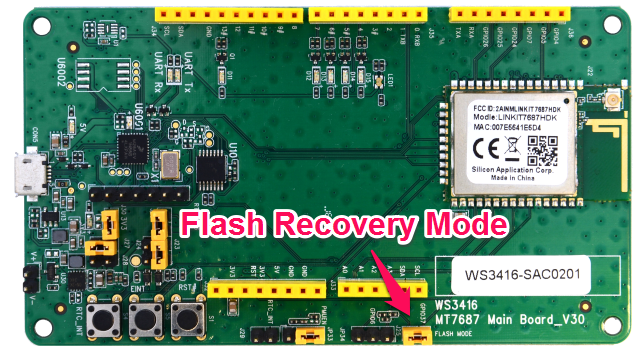
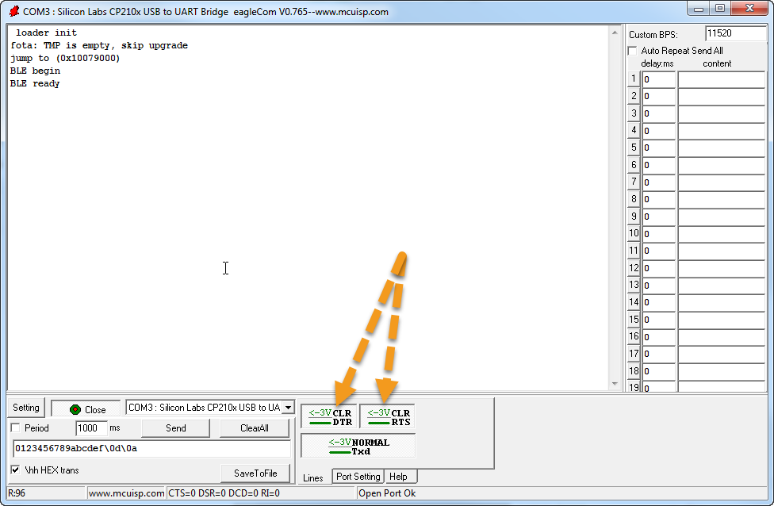
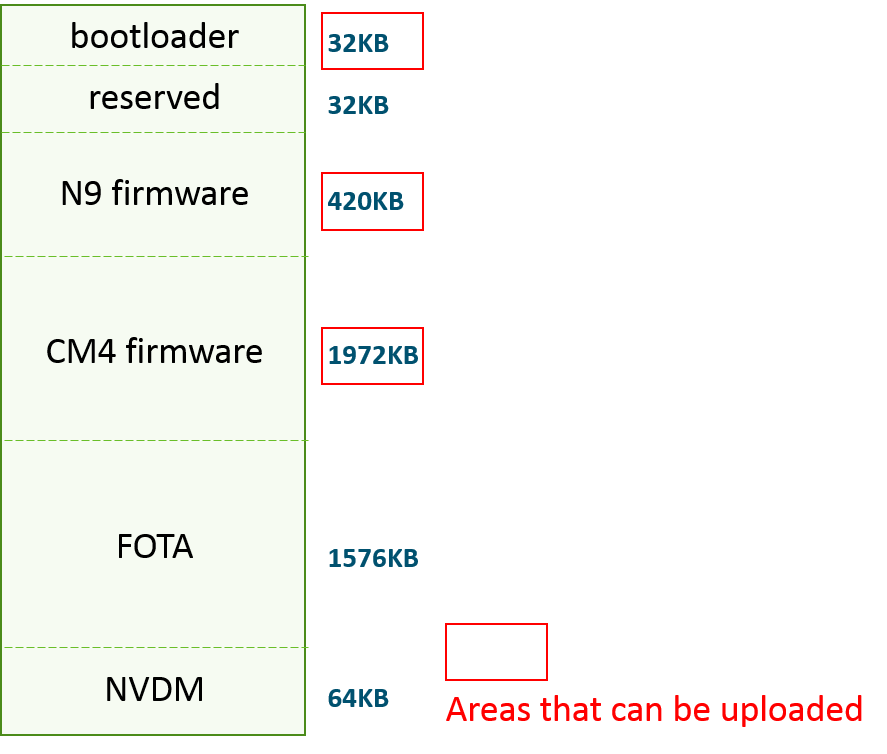
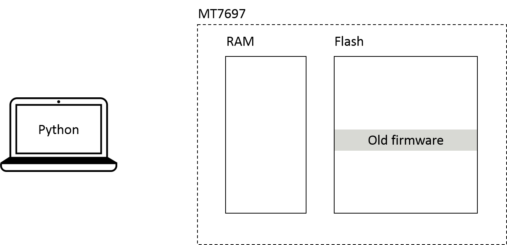
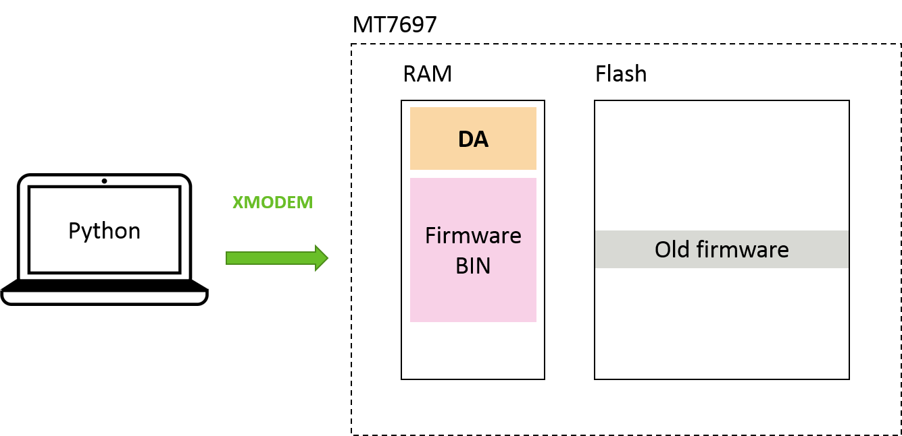
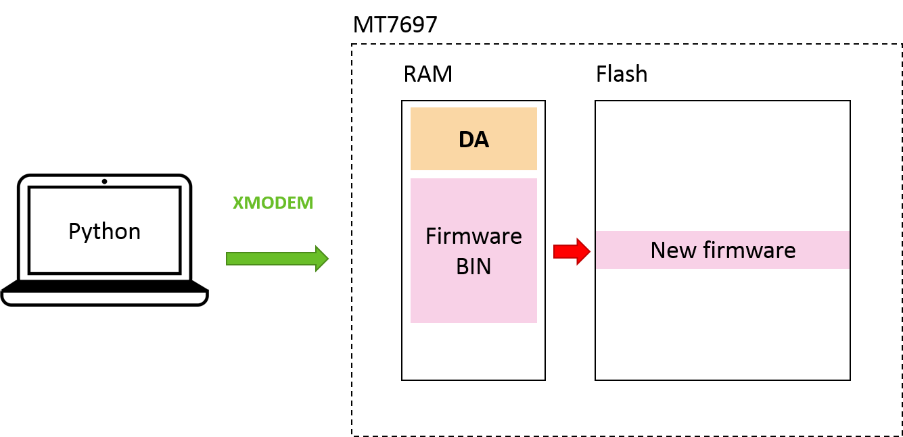

# MT76x7 Uploader

This tool provides the functionality to flash the bootloader and the firmware of the MT7687 and MT7697 platform, including firmwares for both CM4 and the N9 processors.

Official GitHub repository: https://github.com/MediaTek-Labs/mt76x7-uploader

## Features
 * Supports Windows, macOS, and Linux (based on Python 2.7)
 * Supports MT7687 and MT7697
 * Flashes bootloader, CM4(application binary), and N9 firmware sections.

## Options
```
-c COM_PORT      COM port, can be COM1, COM2, ..., COMx
-f BIN_FILE      path of the bin file to be uploaded
-n DA_FILE       path of the DA file to be used. The default file is da97.bin for mt7697 and da87.bin for mt7687
-p PLATFORM_NAME platform to be flashed (mt7687 | mt7697). The default platform is mt7697
-t FLASH_TARGET  target to be flashed (cm4 | ldr | n9). The default target is cm4
```

## Examples

### Windows
```
upload.exe -c COM24 -f sample.bin -t cm4 -p mt7687
```

### Linux and macOS
```
python ./upload.py -c /dev/tty.usbmodem1412 -f sample.bin -t cm4 -p mt7687
```

### Flash a build from LinkIt SDK
If you build your project using LinkIt SDK 4.x, the output folder should look like this:

```txt
.
├── flash_download.ini
├── your_application.bin
├── mt7697_bootloader.bin
└── WIFI_RAM_CODE_MT76X7_in_flash.bin
```

You can flash the bootloader(`mt7697_bootloader.bin`), N9 firmmware(`WIFI_RAM_CODE_MT76X7_in_flash.bin`) and application binary by copying these files to the uploader tool folder and type the following command:

```bash
python upload.py -c /dev/tty.usbmodem1412 -n da97.bin -t ldr -f mt7697_bootloader.bin
python upload.py -c /dev/tty.usbmodem1412 -n da97.bin -t n9 -f WIFI_RAM_CODE_MT76X7_in_flash.bin
python upload.py -c /dev/tty.usbmodem1412 -n da97.bin -t cm4 -f your_application.bin
```

## How It Works


### Flash Access Modes on MT7687 and MT7697

MT7687/97 have 2 bootstrap modes, a normal mode and a **Flash Recovery Mode**. The mode is determined by the state of **GPIO37** during bootup. The table below is excerpted from MT7697 datasheet:


GPIO37 maps to **P6** on LinkIt 7697 HDK, as shown in the pinout diagram:


### Switching Flash Modes on LinkIt 7687

On LinkIt 7687, an onboard jumper is used to determine the GPIO37 state.



The straightforward approach is easy to understand, but this also implies that the user must manually adjust the jumper state for each upload and execution. This can be a bit inconvinient to users.

### Switching Flash Modes on LinkIt 7697

On LinkIt 7697, to improve the usability, the GPIO37 state is controlled by the onboard **CP2102N** USB-to-UART chipset. The GPIO37 pin is connected to the flow contorl pins of CP2102N. This allows our Python script to reset the board and put the board in to Flash Recovery Mode without user intervention.

The truth table of the control logic is:

| DTR | RTS | GPIO37 | SYS_RST_N |
|:---:|:---:|:------:|:---------:|
|  0  |  0  |    0   |     1     |
|  1  |  1  |    0   |     1     |
|  0  |  1  |    0   |     0     |
|  1  |  0  |    1   |     1     |


As a result, if you use a terminal program to access the serial port of LinkIt 7697, be aware of the flow control settings in the terminal program. For example, the **Flow control** field in **PuTTY** (set it to *None*):


Or the DTR/RTS settings in the **Lines** tab of **eagleCom**:



### Flasy Layout

The flash layout of LinkIt 7697 is shown in the image below - note the flash size and layout is different on LinkIt 7687.



There are 3 regions that can be uploaded:
 * bootloader
 * N9 firmware (Wi-Fi and Bluetooth subsystem)
 * CM4 firmwear (the application binary - this is the most commonly updated part during your development)

 The following regions are reserved for LinkIt SDK modules:
  * FOTA: reserved for firmware update over-the-air
  * NVDM: reserved for a non-volatile data manager that stores persistent data

### Uploading Flow

Initially state of RAM and Flash looks like this:


The Python script resets the board and put it into Flash Recovery mode. Under this mode the MT7697 chipset BootROM(BROM) accepts data from UART0 to write a small program to the RAM. We call this small program the **Download Agent**(DA) program.



This DA program then takes over the CM4 processor to receive data from the Python script through XModem protocol:



Finally, the script resets the board again and reboot it into normal execution mode. This completes the flash uploading process.


